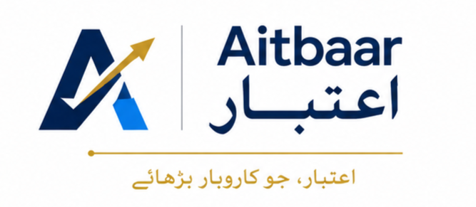

<p align="center">
  
</p>

# Aitbaar (اعتبار) — Trust

**AI-assisted SME loan origination.** Built for the UBL National Innovation Hackathon 2026 (theme: Artificial Intelligence in Banking).

Pakistan has ~5M SMEs producing 40% of GDP, yet only ~155k hold a bank loan. The barrier is friction: 3–5 branch trips because the document checklist is *discovered* by the officer, never declared; 40–60 pages read by hand per file; weeks to a decision. Aitbaar kills that loop:

- The SME owner applies **on WhatsApp, in Urdu**, from behind the counter — full document checklist up front, explicit consent, zero branch visits.
- A real AI engine runs **extract → verify → score → explain**: Gemini vision extraction, deterministic cross-document fraud flags, an XGBoost repayment model trained on a documented 1,000-row synthetic Pakistani SME dataset, SHAP factor attribution, and an LLM brief written *from the SHAP output only*.
- The **loan officer reads one page, not fifty** — score /100, risk tier, factors, red flags, recommended range — then approves, declines, or requests exactly **one** missing item. Every step lands in an audit trail.

## Architecture

```
SME owner ──WhatsApp (Urdu)──► whatsapp-bot (Node, whatsapp-web.js, Docker+Railway volume)
                                    │ REST
                                    ▼
                    backend (FastAPI on Railway) ── engine: extract → verify → score → explain
                                    ▲ REST                    (Gemini vision · rules+rapidfuzz ·
                                    │                          XGBoost+SHAP · LLM brief)
Loan officer ──browser──► dashboard (React on Vercel)
```

| Folder | What | Runs on |
|---|---|---|
| `backend/` | FastAPI API + AI engine, trained model in `models/`, dataset + generator in `data/` | Railway (Dockerfile) |
| `whatsapp-bot/` | Applicant channel; session persists on a volume, links via a web `/qr` page | Railway (Dockerfile + volume) |
| `dashboard/` | Loan officer queue + one-page credit brief + audit trail | Vercel |
| `docs/` | **Source of truth**: API contract, data model, specs, decision log, demo runbook | — |

## Quick start (local)

```bash
# 1. Backend (in-memory store, seeds 3 demo applicants; OPENROUTER_API_KEY optional — falls back to templates)
cd backend && pip install -r requirements.txt
uvicorn app.main:app --reload --port 8000

# 2. Dashboard
cd dashboard && npm install && npm run dev        # http://localhost:5173

# 3. WhatsApp bot (needs a phone to scan /qr once)
cd whatsapp-bot && npm install && npm start       # http://localhost:8001/qr

# End-to-end test without WhatsApp (drives the real bot state machine against the API):
cd whatsapp-bot && node test/e2e.js
```

`GET /demo/reset` re-seeds the three demo files (clean approve / borderline / name-mismatch fraud flag) through the real pipeline.

## Deploy + demo

Follow [`docs/demo-runbook.md`](docs/demo-runbook.md) — setup is ~30 minutes on Railway + Vercel free tiers.

## Team & workflow

Team Aitbaar (Lahore): Muhammad Anas Tahir (lead, AI engine), Muhammad Obaidullah (AI engine), Ali Ateeb (dashboard), Ali Zulfiqar (WhatsApp bot).

`main` = stable · `stage` = integration (everything merges here first) · branches `name/feature`. Contract changes touch `backend/app/models/schemas.py` + `docs/api.md` in the same commit. See [`docs/git-workflow.md`](docs/git-workflow.md).

## Honesty notes (also stated in the deliverables)

Synthetic data only — no real customer data anywhere. Model metrics (`backend/models/METRICS.md`, AUC 0.778) prove the pipeline works end-to-end, not real-world predictive power; the remedy is a bank pilot on real files. Core banking (Temenos) integration is mocked. The AI recommends; the officer decides.
