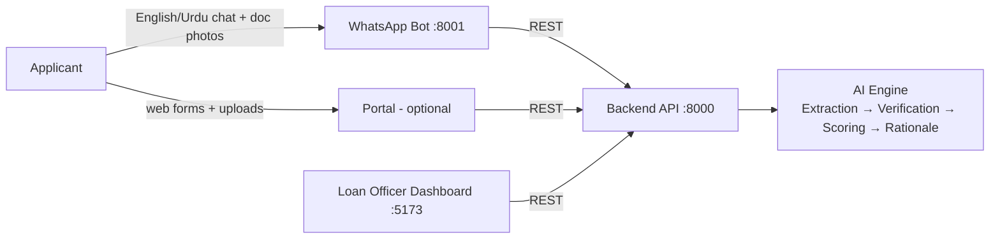

# Architecture

Aitabaar is 3 running services + 1 optional, in one monorepo.

## Components

| Service | Folder | Stack | Port (dev) | Owner |
|---|---|---|---|---|
| Backend API + AI Engine | `backend/` | Python, FastAPI, XGBoost+SHAP, Gemini vision LLM | 8000 | Anas, Obaid |
| WhatsApp Bot | `whatsapp-bot/` | Node.js, whatsapp-web.js | 8001 | Ali Zulfiqar |
| Loan Officer Dashboard | `dashboard/` | React (Vite) + Tailwind + Recharts | 5173 | Ali Ateeb |
| Applicant Portal | `portal/` | **Cut from hackathon scope** — architecture is channel-agnostic, front door is a swap | — | — |

**Boundary rule:** the bot and dashboard talk to the backend **only** through the REST API in [api.md](api.md). They never import backend code, never touch the DB, never call the LLM directly. This is what lets 4 people build in parallel.

## The AI engine (inside backend)

Four stages, each a module in `backend/app/engine/`:

1. **Extraction** (`extraction.py`) — **Gemini vision LLM** parses CNIC, bank statements, utility bills, questionnaire into structured JSON → `Document.extracted_fields`.
2. **Verification** (`verification.py`) — deterministic cross-checks BEFORE scoring: CNIC name vs bank statement name, address consistency, statement gaps, date validity → `inconsistency_flags`.
3. **Scoring** (`scoring.py`) — XGBoost over extracted features → repayment probability, risk tier (A–D), recommended amount. SHAP values per feature.
4. **Rationale** (`rationale.py`) — LLM writes the one-page credit brief **from the SHAP output only**, so it cannot invent a reason the model did not use.

Until the engine is real, `POST /applications/{id}/score` returns a **mock score** so the dashboard and bot are never blocked.

## Data flow (happy path)

1. Applicant messages the WhatsApp number → bot walks them through consent + doc uploads (see [whatsapp-bot-flow.md](whatsapp-bot-flow.md)).
2. Bot: `POST /applications` (draft) → `POST /applications/{id}/documents` per file → `POST /applications/{id}/submit`.
3. Backend runs the engine (extract → verify → score → rationale) → status `scored`.
4. Officer opens dashboard queue → reviews AI credit brief + SHAP factors + source docs → `POST /applications/{id}/decision` (approve / reject / request_docs).
5. `request_docs` → status `needs_docs` → bot notifies applicant, collects the missing doc, resubmits.
6. Every step appends to `audit_trail` — this is the explainability/compliance story for judges.

## Environments & deployment

Per the submitted Prototype Blueprint:

- **Backend (FastAPI):** Railway.
- **Dashboard (React):** Vercel.
- **Database:** Supabase Postgres — applications, extracted fields, scores, SHAP factors, briefs, decisions, consent records, audit log. **Supabase Storage** for the source documents. (Until wired: backend's in-memory mock store, resets on restart.)
- **WhatsApp:** `whatsapp-web.js` running on the sach batao number — no Meta Cloud API, no webhook URL, zero per-message cost. The bot process holds a WhatsApp Web session and calls the backend REST API. In production this rides the bank's official WhatsApp Business number instead.
- **Mock Temenos endpoint:** a stub API route marking exactly where UBL core banking / loan origination would connect (PLANNED in api.md).
- **Dev:** everything on localhost, backend serves seeded mock data on boot. `.env` per service, template in root `.env.example`.

## Security / compliance posture (for the pitch)

- Consent captured explicitly (bot consent step / portal toggle) before any document is processed; stored on the application.
- Human-in-the-loop: the AI never approves/rejects — it recommends; the officer decides. Audit trail records both.
- Explainability: every score ships with SHAP factors + plain-language rationale.
- Demo data is synthetic/dummy — no real CNICs, no real bank statements in the repo or demo.
