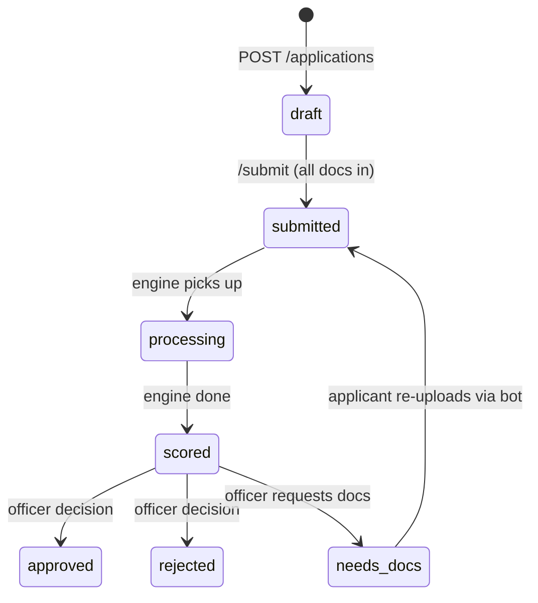

# Data Model

Source: `backend/app/models/schemas.py`. Everything below is what the API actually returns.

## Application (the root entity)

| Field | Type | Notes |
|---|---|---|
| `id` | string | server-assigned, `APP-XXX` |
| `channel` | enum | `whatsapp` \| `portal` |
| `status` | enum | see lifecycle below |
| `applicant` | Applicant | embedded |
| `requested_amount_pkr` | int | what the applicant asked for |
| `documents` | Document[] | uploaded docs + extraction results |
| `pending_doc_requests` | DocumentType[] | set by `request_docs` decision, cleared on resubmit; bot asks for `[0]` |
| `score` | ScoreResult \| null | null until engine runs |
| `audit_trail` | AuditEvent[] | append-only, never edited |
| `created_at`, `updated_at` | datetime | UTC |

## Status lifecycle

`draft → submitted → processing → scored → approved | rejected`, with `needs_docs` looping back. In mock mode `processing` may be skipped (submit → score directly).

**Who moves status:** bot/portal move `draft→submitted`; engine moves `submitted→processing→scored`; **only the officer** moves `scored→approved/rejected/needs_docs`. The AI never decides.

## Applicant

| Field | Type | Notes |
|---|---|---|
| `name` | string | required |
| `cnic_number` | string \| null | format `XXXXX-XXXXXXX-X`; may start null, filled from CNIC extraction |
| `phone` | string | E.164, e.g. `+9230012345 67` — the bot's key for lookup |
| `business_name` | string | required |
| `business_type` | string \| null | free text for now |
| `city` | string \| null | |
| `language` | enum | `en` \| `ur` — bot replies in this language |
| `consent_given` | bool | must be `true` before any processing |

## Document

| Field | Type | Notes |
|---|---|---|
| `id` | string | `DOC-XXX` |
| `type` | enum | `cnic` \| `bank_statement` \| `utility_bill` \| `business_questionnaire` |
| `filename` | string | |
| `uploaded_at` | datetime | |
| `extracted_fields` | object | free-form per type — see extraction targets below |
| `verification_flags` | string[] | human-readable inconsistency notes |

**Extraction targets per doc type** (engine team fills; keys are lower_snake_case):

- `cnic`: `name`, `cnic`, `dob`, `address`
- `bank_statement`: `avg_monthly_inflow_pkr`, `avg_monthly_outflow_pkr`, `months`, `end_balance_pkr`, `bounced_cheques`
- `utility_bill`: `name`, `address`, `on_time` (bool), `months_history`
- `business_questionnaire`: `years_in_business`, `employees`, `monthly_revenue_pkr`, `loan_purpose`

## ScoreResult

| Field | Type | Notes |
|---|---|---|
| `repayment_probability` | float 0–1 | XGBoost output — dashboard displays it as **credit score 0–100** = round(p × 100) |
| `risk_tier` | enum | `A` (best) \| `B` \| `C` \| `D` |
| `recommended_amount_pkr` | int | may differ from requested |
| `factors` | ShapFactor[] | top SHAP contributions, both directions |
| `rationale` | string | one-paragraph plain-language credit brief |
| `inconsistency_flags` | string[] | verification-stage red flags |

**ShapFactor:** `feature` (model feature name) · `label` (human-readable, what the dashboard shows) · `impact` (signed float) · `direction` (`positive` \| `negative`).

## AuditEvent

`at` (datetime) · `actor` (`system` \| `engine` \| officer name) · `action` (`created`, `submitted`, `scored`, `approve`, `reject`, `request_docs`, ...) · `detail` (free text).

Append-only. This list is the compliance/explainability story — every state change must add one.
